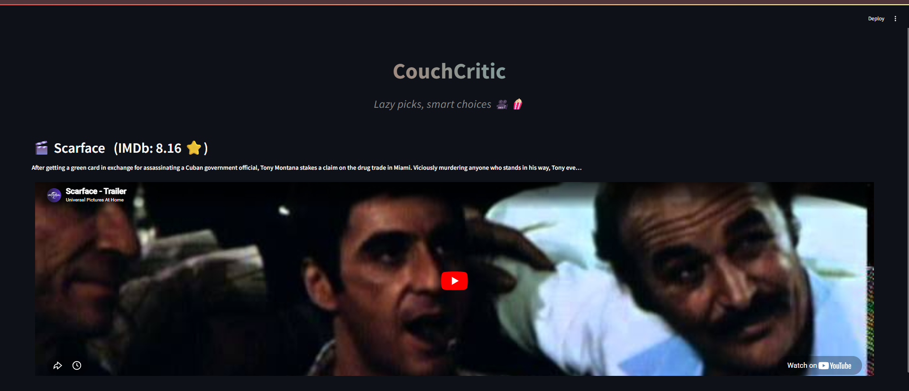
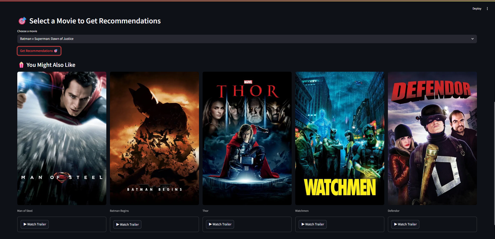

# 🎬 CouchCritic — *Lazy picks, smart choices* 🍿

> A content-based movie recommendation web app built with Python & Streamlit.  
> Pick a movie, get 5 similar recommendations, watch trailers — all in one place.

---

## 📸 Screenshots

**Dynamic Banner with Live Trailer**


**Movie Recommendations with Posters**


---

## ✨ Features

| Feature | Description |
|---|---|
| 🎲 Dynamic Banner | A random featured movie loads on startup with its IMDb rating and embedded YouTube trailer |
| 🎯 Smart Recommendations | Pick any movie from 5000+ titles and get 5 similar picks instantly |
| 🖼️ Live Posters | Real movie posters fetched from TMDb API in real time |
| ▶️ Trailer Preview | Watch any recommended movie's trailer right inside the app |
| ⚡ Cached & Fast | API results are cached — no repeated calls, no slowdowns |

---

## 🛠️ Tech Stack

- **Python 3.x**
- **Streamlit** — UI framework
- **TMDb API** — live movie data, posters & trailers
- **Scikit-learn** — cosine similarity for content-based filtering
- **Pandas / Pickle** — data handling and model storage

---

## 🚀 Getting Started

### 1. Clone the repository
```bash
git clone https://github.com/tanishak0000007777/CouchCritic.git
cd CouchCritic
```

### 2. Install dependencies
```bash
pip install streamlit requests pandas
```

### 3. Make sure these files are in the project folder
```
CouchCritic/
│── app.py             # Main Streamlit app
│── movie.pkl          # Pickled movie dataset
│── similarity.pkl     # Precomputed cosine similarity matrix
│── img1.png           # Screenshot — banner
│── img2.png           # Screenshot — recommendations
│── README.md
```

### 4. Run the app
```bash
streamlit run app.py
```

---

## 🎮 How to Use

1. The app opens with a **random featured movie** at the top with its trailer playing.
2. Scroll down and **select any movie** from the dropdown (5000+ titles).
3. Click **"Get Recommendations 🎯"**.
4. Browse the **5 recommended movies** with their posters.
5. Click **"▶ Watch Trailer"** under any movie to preview it instantly.

---

## 🧠 How the Recommendation Engine Works

The engine uses **content-based filtering**:

1. Movie metadata (genres, cast, crew, keywords, overview) is combined into a single text tag per movie.
2. These tags are vectorized using **CountVectorizer**.
3. **Cosine similarity** is computed between all movie vectors.
4. When you pick a movie, the 5 most similar vectors are returned as recommendations.

The similarity matrix is precomputed and saved as `similarity.pkl` so the app loads instantly.

---

## 🔑 API

This project uses the [TMDb API](https://www.themoviedb.org/documentation/api) for:
- Movie details and IMDb ratings
- Movie poster images
- YouTube trailer links

The API key used is a public demo key. For production use, register for a free key at [themoviedb.org](https://www.themoviedb.org/).

---

## 📁 Project Structure

```
CouchCritic/
│
├── app.py              # Main application — UI, API calls, recommendation logic
├── movie.pkl           # Pickled DataFrame with movie titles and IDs
├── similarity.pkl      # Precomputed cosine similarity matrix (5000×5000)
├── img1.png            # App screenshot — banner section
├── img2.png            # App screenshot — recommendations section
└── README.md
```

---

## 🤝 Contributing

Pull requests are welcome! If you find a bug or want to add a feature (user ratings, watchlist, streaming links), feel free to fork and open a PR.

---

## 📄 License

This project is open-source under the [MIT License](https://opensource.org/licenses/MIT). Free to use, modify, and distribute.

---

## 👨‍💻 Author

**Tanishak Bansal**  
[](https://github.com/tanishak00000007777)

---

*Built with ❤️ for movie lovers everywhere.*
